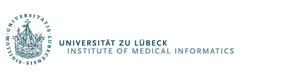

# 👋 Hi there, I’m **Ziad**  

  

### 🧑‍🔬 **PhD Student | Research Assistant**  
📍 University of Lübeck, Germany  
🔬 Specializing in **Medical Deep Learning for MRI Reconstruction & Motion Correction**  

  

## 🚀 **Research Interests**  
- 🧠 **MRI Reconstruction & Acceleration**  
- 📡 **Motion Compensation & Correction**  
- 🔄 **Image Registration**  

## 🛠 **Tech Stack & Skills**  
🔹 **Languages:** Python, C++, Matlab, LaTeX  
🔹 **Deep Learning Frameworks:** PyTorch  
🔹 **Specialties:** Medical Deep Learning, Machine Learning  

## 📬 **Get in Touch**  
  
  
📧 **Email:** [z.alhajhemidi@uni-luebeck.de](mailto:z.alhajhemidi@uni-luebeck.de)  

---

## 📊 **GitHub Stats**  
  

    
  

